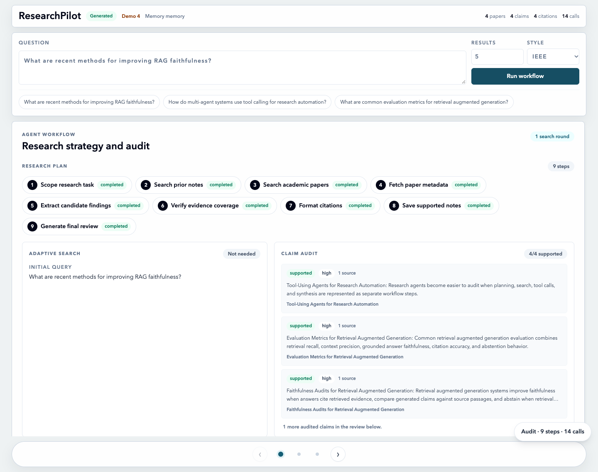
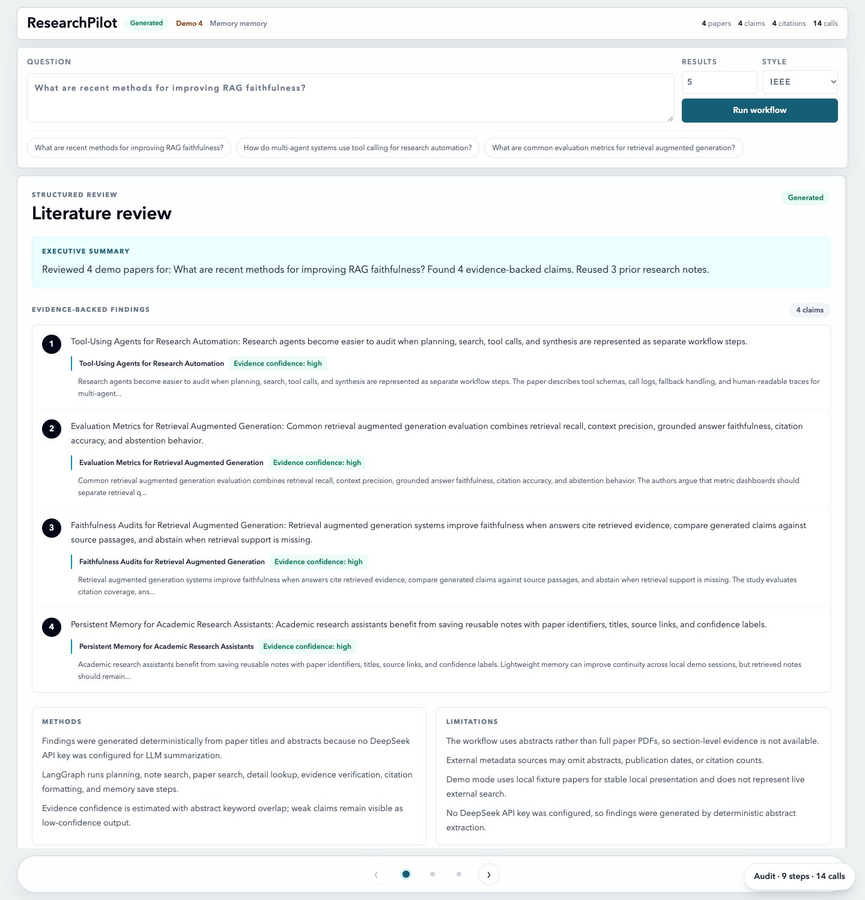
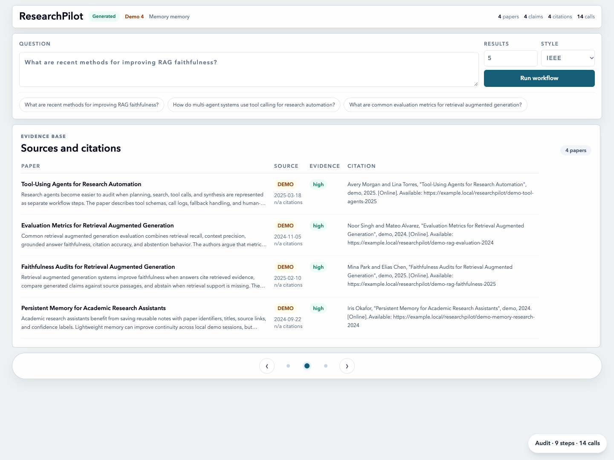
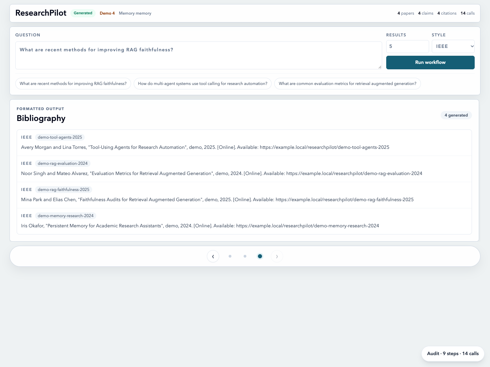
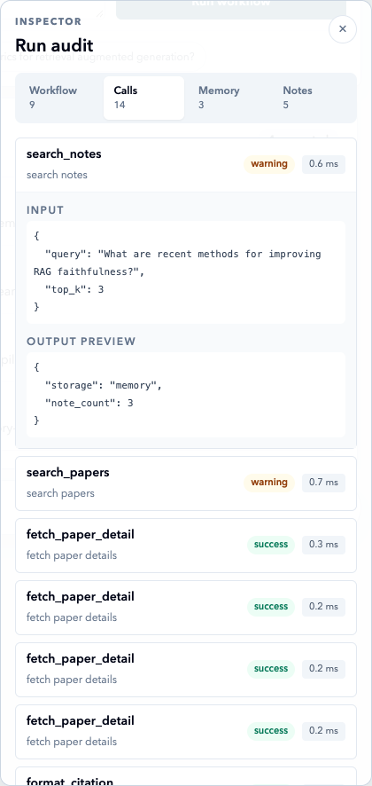
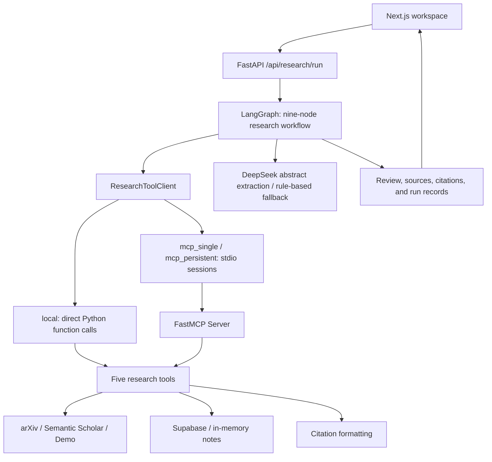

# ResearchPilot

[简体中文](README.md) | **English**

**An inspectable research workflow for paper search, abstract synthesis, and citation formatting.**

Start with a research question and inspect candidate papers, abstract-level findings, source links, references, and the tool calls and fallbacks behind each run. Built for preliminary literature research with **LangGraph state orchestration, an MCP tool layer, and a Next.js workspace**. Currently a local, single-user application.

[Screenshots](#screenshots) | [Key Design Decisions](#key-design-decisions) | [Run Locally](#run-locally) | [Validation Record (Chinese)](docs/VALIDATION.md) | [Architecture (Chinese)](docs/ARCHITECTURE.md)

## Overview

| User need | Implementation | Inspectable output |
| --- | --- | --- |
| Find papers for a research question | Search arXiv, try Semantic Scholar if results are insufficient, and conditionally run one additional query | Paper titles, authors, abstracts, and sources |
| Organize preliminary findings | Extract candidate findings with DeepSeek, or select abstract sentences using rules when the model is unavailable | A structured review, methods, and limitations |
| Check findings against source material | Associate papers using abstract keyword overlap and format IEEE / APA / BibTeX references | Abstract previews, match levels, and references |
| Understand what happened during a run | Record workflow steps, tool argument previews, durations, warnings, and fallbacks | Run audit and research notes |

**Implementation: 9 workflow nodes, 5 MCP tools, and 3 tool execution modes.**

`confidence` represents lexical overlap with abstracts, not factual accuracy. The application does not read full papers or guarantee that retrieved results are relevant to the question. Findings require manual review.

## Screenshots

These screenshots show an **actual local run in Demo mode**, using fictional sample papers bundled with the repository, rule-based abstract extraction, and in-memory notes. No external model is called. They demonstrate the interface and execution flow, **not real-world retrieval quality or model accuracy**.



<details>
<summary>View the review, paper sources, bibliography, and tool calls</summary>

### Structured Review

Findings include source abstracts and match levels. The methods section identifies whether the run used a model or a rule-based fallback.



### Paper Sources

Demo entries are explicitly labeled rather than presented as live search results.



### Bibliography



### Tool Call Audit

Expand a call to inspect its input, output preview, duration, and status. Warnings about in-memory storage remain visible.



</details>

See the [demo walkthrough (Chinese)](docs/DEMO_SCRIPT.md) to reproduce the run.

## Key Design Decisions

| Design focus | Implementation and trade-off | Source |
| --- | --- | --- |
| Explicit workflow | Nine nodes share research state. Code controls execution, with at most one additional search round to avoid unbounded loops | [graph.py](backend/app/agent/graph.py), [nodes.py](backend/app/agent/nodes.py) |
| Separate orchestration from tools | One tool interface supports local functions, one-shot stdio sessions, and a persistent MCP session. Persistent mode uses a background event loop and a queue | [client.py](backend/app/mcp_client/client.py), [server.py](mcp_server/server.py) |
| Visible fallbacks | Try cached search results after external retrieval failures, select abstract sentences after model failures, and optionally fall back to local tools after MCP failures, with warnings | [search_papers.py](mcp_server/tools/search_papers.py), [nodes.py](backend/app/agent/nodes.py) |
| Inspectable findings | Link findings to papers and abstract previews while retaining low-match results. Keyword heuristics are explainable but do not establish semantic entailment | [verification_service.py](backend/app/services/verification_service.py) |

### Request Flow



The nine nodes run in order: **task planning -> note search -> paper search -> metadata lookup -> candidate finding extraction -> abstract matching -> citation formatting -> note saving -> review assembly**.

`adaptive search` runs inside the paper search node, not as a tenth node. It adds one query only when the existing results are nonempty, below the requested count, and include a non-Demo paper. The model does not decide when to search again, and final finding quality does not drive a retrieval loop.

### MCP Tools and Execution Modes

Five tools: `search_papers`, `fetch_paper_detail`, `search_notes`, `save_to_notes`, and `format_citation`.

| Mode | Execution | Lifecycle and limitations |
| --- | --- | --- |
| `local` (default) | Call tool functions directly, without the MCP protocol | In-memory notes and caches live with the backend process |
| `mcp_single` | Start a stdio server and initialize a session for each tool call | In-memory notes do not survive across tool calls |
| `mcp_persistent` | Reuse an MCP server process and session | Avoid repeated startup; this is not database persistence, and tool calls currently run serially |

## Run Locally

Requires Python, Node.js/npm, and Bash (macOS / Linux, or WSL on Windows). See the [validation record (Chinese)](docs/VALIDATION.md) for the tested environment and dependency versions.

```bash
git clone https://github.com/AZ123IT/ResearchPilot.git
cd ResearchPilot
python3 -m venv .venv
.venv/bin/python -m pip install -r backend/requirements.txt -r mcp_server/requirements.txt
cd frontend
npm install
cd ..
```

### Start with the No-Key Demo

In the first terminal, run the following from the repository root. This disables local `.env` loading and clears optional service credentials to avoid accidentally using configured cloud services:

```bash
PYTHON_DOTENV_DISABLED=1 DEEPSEEK_API_KEY= SUPABASE_URL= SUPABASE_SERVICE_ROLE_KEY= \
RESEARCH_TOOL_CLIENT_MODE=local RESEARCHPILOT_DEMO_MODE=true scripts/run_backend.sh
```

In a second terminal, also from the repository root:

```bash
scripts/run_frontend.sh
```

Open the [research workspace](http://127.0.0.1:3000/research) or the [API documentation](http://127.0.0.1:8000/docs). Example question: `What are recent methods for improving RAG faithfulness?`

### Enable Live Retrieval and Model Extraction

Copy [.env.example](.env.example) to a local `.env` without overwriting an existing file. Set `RESEARCHPILOT_DEMO_MODE=false`, optionally provide `DEEPSEEK_API_KEY`, and restart the backend with `scripts/run_backend.sh`. arXiv retrieval does not require a model API key; without a configured model, the workflow uses rule-based abstract extraction.

| Configuration | Purpose |
| --- | --- |
| `DEEPSEEK_API_KEY`, `DEEPSEEK_BASE_URL`, `DEEPSEEK_MODEL` | Optional model-based extraction from the titles and abstracts of at most the first five papers |
| `SEMANTIC_SCHOLAR_API_KEY` | Optional Semantic Scholar credentials; usage remains subject to service limits |
| `SUPABASE_URL`, `SUPABASE_SERVICE_ROLE_KEY` | Optional persistent note storage; apply [schema.sql](supabase/schema.sql) before use |
| `RESEARCH_TOOL_CLIENT_MODE` | `local`, `mcp_single`, or `mcp_persistent` |
| `MCP_FALLBACK_TO_LOCAL` | Allow local tool fallback after MCP failures; set to `false` when verifying the actual MCP path |
| `NEXT_PUBLIC_API_BASE_URL` | Frontend API URL; the startup script reads it from the terminal environment, defaulting to `http://127.0.0.1:8000` |

The standalone MCP entry point is `scripts/run_mcp_server.sh`. In backend MCP modes, the client starts the server, so a separate manually started server process is unnecessary. See [MCP sessions and tool boundaries (Chinese)](docs/ARCHITECTURE.md#mcp-会话与工具边界) for details.

## Validation and Tests

**Local validation on 2026-10-03: 32 pytest tests passed, and TypeScript type checking passed.** Commands, build results, and browser checks are documented in the [validation record (Chinese)](docs/VALIDATION.md).

```bash
scripts/test_all.sh
```

Tests cover workflow routing, API response structure, citation formatting, abstract matching, search caching, tool modes, and fallback branches. **Passing regression tests does not establish retrieval quality.** External APIs are mainly mocked in tests. The project does not currently include relevance/factuality evaluation on a real query set or a configured GitHub Actions CI workflow.

## Stack and Code Navigation

| Layer | Technologies | Entry points |
| --- | --- | --- |
| Interface | Next.js, React, TypeScript, Tailwind CSS | [frontend/app/research](frontend/app/research), [components](frontend/components) |
| API and state orchestration | FastAPI, Pydantic, LangGraph | [backend/app/api](backend/app/api), [agent](backend/app/agent) |
| Tool protocol and data sources | MCP Python SDK / FastMCP, httpx | [mcp_server](mcp_server), [mcp_client](backend/app/mcp_client) |
| Model and notes | DeepSeek, Supabase PostgreSQL / in-memory storage | [llm](backend/app/llm), [notes.py](mcp_server/tools/notes.py) |
| Regression checks | pytest, TypeScript typecheck | [backend/tests](backend/tests), [mcp_server/tests](mcp_server/tests) |

## Limitations and Next Steps

- **Abstract-level processing:** No full-text PDF downloads. Abstract previews are truncated text, not precisely located supporting sentences.
- **Heuristic matching:** Keyword overlap cannot assess negation, causality, or question relevance. Even a `high` match can be wrong. The next step is to establish relevance and finding-support evaluation sets before improving retrieval and verification.
- **Fixed workflow:** This is not autonomous multi-agent collaboration. Planning and review assembly use code templates; event streaming and checkpoint-based resume are not implemented.
- **Limited note reuse:** Historical notes are retrieved by keywords and displayed, but not injected into DeepSeek context. `vector(1536)` is a reserved schema field, not implemented vector retrieval.
- **Local, single-user scope:** No authentication, tenant isolation, public deployment, or production capacity validation. Persistent MCP sessions and in-memory caches do not replace a database.

Security: Do not commit `.env` or expose service keys to the frontend. Enabling DeepSeek sends the question and paper titles/abstracts to the model provider; enabling Supabase stores notes there. Do not use sensitive research material without authorization.

Further documentation is currently in Chinese: [Architecture and Trade-offs](docs/ARCHITECTURE.md) | [Demo and Troubleshooting](docs/DEMO_SCRIPT.md) | [Validation Record](docs/VALIDATION.md) | [Technical Q&A](docs/INTERVIEW_NOTES.md).
