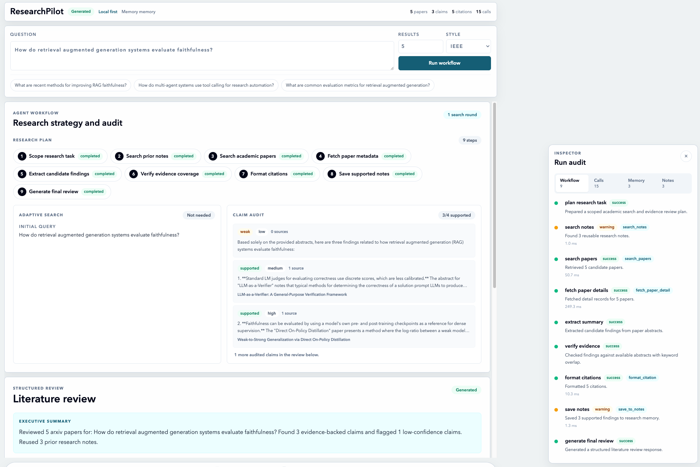
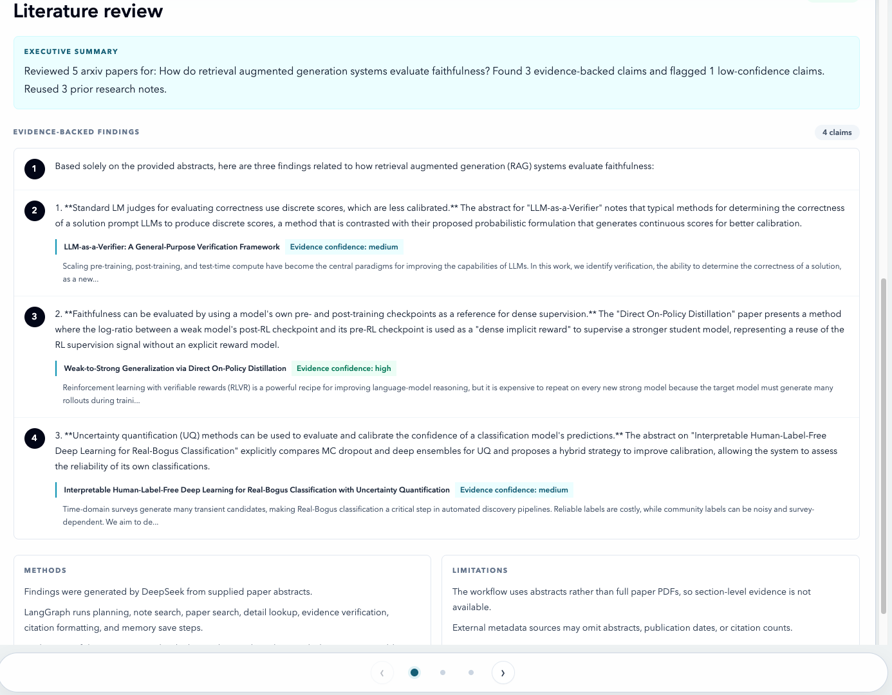
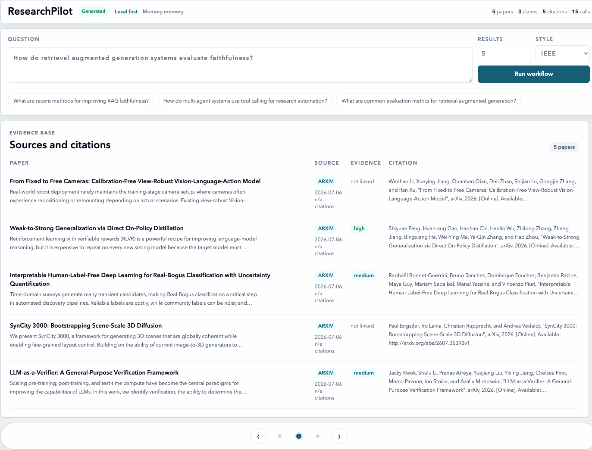
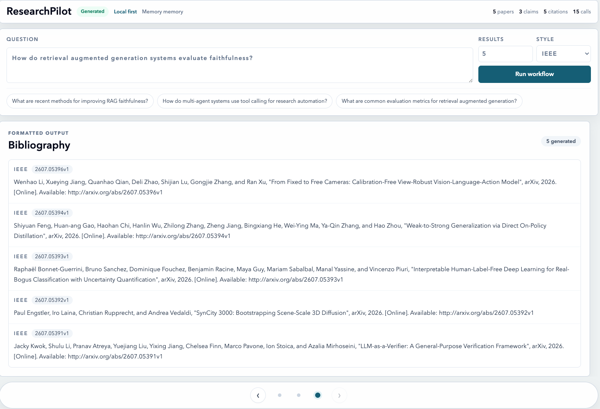
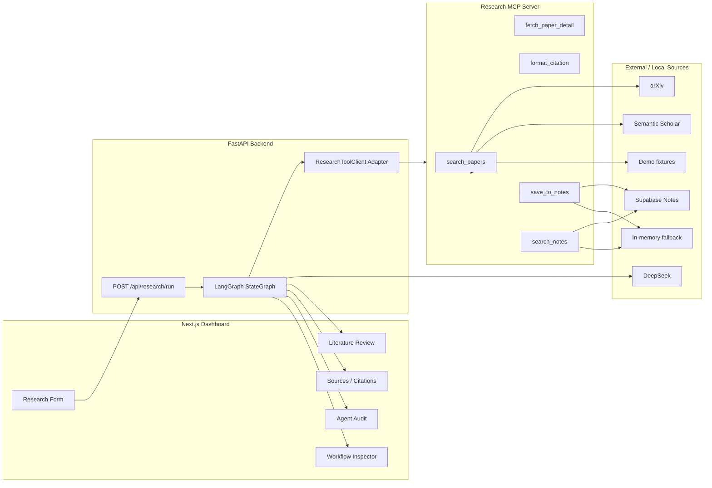

# ResearchPilot：MCP 学术科研效率助手

ResearchPilot 是一个适合放在简历里的全栈 AI Agent 项目。用户输入一个学术研究问题后，系统会通过 LangGraph 编排多步骤研究 workflow，调用自定义 MCP-style research tools 完成论文检索、历史 notes 复用、论文详情获取、候选结论抽取、证据校验、引用生成和 structured literature review 展示。

项目重点不是做一个普通 RAG 聊天框，而是把 agent 的执行过程暴露出来：前端 dashboard 会展示研究计划、每个 workflow step、tool call logs、fallback 状态、证据片段、confidence label、引用和 warnings，让用户能看到结论是从哪些论文、证据和工具调用中产生的。

核心句：

> 输入研究问题，一键生成带证据、引用和可审计 workflow 的 literature review。

当前版本定位是本地可运行的作品集项目，不是生产级多用户 SaaS 产品。

## 演示截图

示例问题：

```text
How do retrieval augmented generation systems evaluate faithfulness?
```

### Agent workflow 与 claim audit



### Literature review



### Sources and citations



### Bibliography



## 功能亮点

- 使用 FastAPI 提供 `/api/research/run` 和 `/health` 接口。
- 使用 LangGraph `StateGraph` 编排多步骤 agent workflow。
- 自定义 Research MCP Server，封装 `search_papers`、`fetch_paper_detail`、`format_citation`、`save_to_notes` 和 `search_notes` 等工具。
- 后端支持 `local`、`mcp_single` 和 `mcp_persistent` 三种 tool client 模式。
- 支持 arXiv 检索、Semantic Scholar fallback、结果去重和短期内存缓存。
- 支持 DeepSeek API；未配置 key 时自动使用 deterministic abstract fallback，保证本地可以稳定演示。
- 支持 demo mode，用本地 fixture papers 做稳定演示，并明确标记为 demo 数据。
- 支持 IEEE、APA 和 BibTeX 引用格式生成。
- 支持 Supabase notes 存储；未配置 Supabase 时自动回退到 in-memory notes。
- 实现 evidence-first 输出：为关键 finding 关联 source paper、abstract snippet、confidence label 和 citation。
- 前端 dashboard 展示 research plan、claim audit、literature review、paper sources、bibliography、workflow inspector 和 MCP tool call logs。
- 覆盖 pytest 后端/MCP 测试和 Next.js TypeScript typecheck。

## 技术栈

- Next.js App Router
- React
- TypeScript
- Tailwind CSS
- FastAPI
- Pydantic
- LangGraph
- MCP-style tool adapter / MCP stdio server
- DeepSeek Chat API
- arXiv API
- Semantic Scholar Graph API
- Supabase / PostgreSQL / pgvector-ready schema
- pytest

## 系统架构



更多架构说明见 [docs/ARCHITECTURE.md](docs/ARCHITECTURE.md)。

## Agent workflow

ResearchPilot 的后端不是一次普通 completion，而是固定、可追踪的 research workflow：

1. `plan_research_task`：规划研究任务、来源和引用格式。
2. `search_notes`：检索历史 research notes，支持 memory reuse。
3. `search_papers`：搜索 arXiv / Semantic Scholar / demo fixture。
4. `adaptive_search`：当初始搜索覆盖不足时，自动扩展查询。
5. `fetch_paper_details`：拉取或整理论文 metadata。
6. `extract_summary`：使用 DeepSeek 或 deterministic fallback 抽取候选 findings。
7. `verify_evidence`：基于 abstract snippet 做轻量证据校验并标记 confidence。
8. `format_citations`：生成 IEEE / APA / BibTeX 引用。
9. `save_notes`：保存有证据支持的 findings，供后续研究复用。
10. `generate_final_review`：生成 structured literature review。

前端会展示 step trace、tool call input/output preview、duration、fallback_used、warnings、low-confidence claims 和 evidence coverage。

## 目录结构

```text
backend/
  app/
    agent/              LangGraph state, graph, nodes
    api/                FastAPI research route
    core/               settings and logging
    llm/                DeepSeek client
    mcp_client/         local / MCP / persistent MCP adapters
    models/             Pydantic response schemas
    services/           citation, note, verification services
  tests/                backend API and graph tests
mcp_server/
  clients/              arXiv and Semantic Scholar clients
  data/                 demo paper fixtures
  tools/                MCP-style tool implementations
  tests/                MCP tool tests
frontend/
  app/research/         dashboard page
  components/           form, review, sources, citations, inspector, audit panel
  lib/                  API client and TypeScript types
supabase/
  schema.sql            pgvector-ready notes schema
docs/
  ARCHITECTURE.md
  DEMO_SCRIPT.md
  INTERVIEW_NOTES.md
  screenshots/
scripts/
  run_backend.sh
  run_frontend.sh
  run_mcp_server.sh
  test_all.sh
```

## 本地运行

在项目根目录执行：

```bash
python3 -m venv .venv
.venv/bin/python -m pip install -r backend/requirements.txt -r mcp_server/requirements.txt
cd frontend
npm install
cd ..
cp .env.example .env
```

编辑 `.env`：

```env
DEEPSEEK_API_KEY=your_deepseek_api_key
RESEARCHPILOT_DEMO_MODE=false
NEXT_PUBLIC_API_BASE_URL=http://127.0.0.1:8000
```

启动后端：

```bash
scripts/run_backend.sh
```

另开一个终端启动前端：

```bash
scripts/run_frontend.sh
```

打开：

```text
http://127.0.0.1:3000/research
```

如果只想做稳定演示，不依赖外部论文 API，可以启动 demo mode：

```bash
RESEARCHPILOT_DEMO_MODE=true scripts/run_backend.sh
```

## 环境变量

使用 `.env.example` 作为模板，真实值放在本地 `.env`，不要提交。

```bash
DEEPSEEK_API_KEY=
DEEPSEEK_BASE_URL=https://api.deepseek.com/v1
DEEPSEEK_MODEL=deepseek-chat
ARXIV_TIMEOUT_SECONDS=10
SEMANTIC_SCHOLAR_API_KEY=
RESEARCHPILOT_DEMO_MODE=false

SUPABASE_URL=
SUPABASE_SERVICE_ROLE_KEY=
SUPABASE_NOTES_TABLE=research_notes

RESEARCH_TOOL_CLIENT_MODE=local
MCP_SERVER_COMMAND=
MCP_SERVER_ARGS=mcp_server/server.py
MCP_SERVER_CWD=
MCP_FALLBACK_TO_LOCAL=true

NEXT_PUBLIC_API_BASE_URL=http://127.0.0.1:8000
```

说明：

- `DEEPSEEK_API_KEY` 是可选项。配置后启用 LLM-based finding extraction；未配置时使用 deterministic abstract fallback。
- `SEMANTIC_SCHOLAR_API_KEY` 是可选项。公共搜索可不配置，配置后可改善 rate limit。
- `SUPABASE_URL` 和 `SUPABASE_SERVICE_ROLE_KEY` 是可选项。未配置时 notes 使用 in-memory fallback。
- `RESEARCH_TOOL_CLIENT_MODE` 可选 `local`、`mcp_single` 或 `mcp_persistent`。
- `RESEARCHPILOT_DEMO_MODE=true` 适合本地演示，使用 fixture papers，不代表实时外部搜索。

## MCP 使用方式

直接启动 MCP stdio server：

```bash
scripts/run_mcp_server.sh
```

后端 tool client 模式：

- `local`：直接调用 Python tool function，适合本地开发和测试。
- `mcp_single`：每次 tool call 启动一个 MCP stdio server。
- `mcp_persistent`：复用一个 MCP stdio session，减少重复启动成本。

示例配置：

```env
RESEARCH_TOOL_CLIENT_MODE=mcp_persistent
MCP_SERVER_COMMAND=.venv/bin/python
MCP_SERVER_ARGS=mcp_server/server.py
MCP_SERVER_CWD=/absolute/path/to/researchpilot
MCP_FALLBACK_TO_LOCAL=true
```

如果 MCP 模式启动失败且 fallback 开启，后端会记录 `fallback_used: true` 并使用 local tool fallback。

## 演示流程

推荐问题：

```text
How do retrieval augmented generation systems evaluate faithfulness?
```

运行后可以重点查看：

1. 顶部指标：papers、claims、citations、calls。
2. Research strategy and audit：研究计划、adaptive search 和 claim audit。
3. Literature review：executive summary、evidence-backed findings、methods 和 limitations。
4. Sources and citations：论文来源、证据等级、citation text。
5. Bibliography：IEEE / APA / BibTeX 输出。
6. Inspector：LangGraph steps、MCP tool calls、memory notes 和 warnings。

完整演示脚本见 [docs/DEMO_SCRIPT.md](docs/DEMO_SCRIPT.md)。

## 测试

运行后端测试和前端 typecheck：

```bash
scripts/test_all.sh
```

也可以分别运行：

```bash
.venv/bin/python -m pytest -q
cd frontend
npm run typecheck
```

当前测试覆盖：

- citation formatting
- evidence verification
- MCP search/detail/citation/note tools
- Semantic Scholar response normalization
- demo mode and cache fallback
- MCP client mode selection and persistent fallback
- LangGraph routing and FastAPI response shape
- README/script reproducibility checks

## 安全说明

- 不要提交 `.env`。
- 不要把 `DEEPSEEK_API_KEY`、`SUPABASE_SERVICE_ROLE_KEY` 或任何 API key 放进截图、commit、issue 或 README。
- 只有 `NEXT_PUBLIC_` 前缀的变量可以被前端读取。
- demo mode 使用本地 fixture papers，并明确标记为 `source: "demo"`。
- 当前项目没有登录系统，定位是本地单用户研究工具，不是多用户生产系统。

## 已知限制

- 当前只基于 paper abstract 做证据校验，不读取全文 PDF。
- confidence label 使用 keyword overlap，是轻量 guardrail，不等同于完整事实核查。
- Supabase schema 已预留 `embedding vector(1536)` 字段，但目前还没有生成 embeddings，也没有启用向量相似度检索。
- arXiv keyword search 可能返回弱相关论文；系统会通过 confidence label 和 limitations 暴露这个问题，而不是隐藏它。
- 项目还没有线上部署、认证系统或 CI/CD。

## 后续改进

- 增加 PDF ingestion 和 section-level evidence。
- 生成 embeddings，并用 pgvector 做 notes similarity search。
- 增加 streaming workflow events。
- 优化 arXiv / Semantic Scholar 的跨源排序。
- 增加生产级 auth、部署配置和浏览器端 E2E 测试。

## 简历写法

**ResearchPilot：MCP 学术科研效率助手 / 个人全栈 AI Agent 项目**

- 基于 Next.js、FastAPI、LangGraph 和自定义 MCP-style tools 构建本地学术研究助手，实现论文检索、证据抽取、引用生成、memory reuse 和 structured literature review。
- 设计多步骤 Agent workflow，覆盖 planning、paper search、metadata lookup、summary extraction、evidence verification、citation formatting 和 note saving，并在前端展示 step trace 与 tool call logs。
- 实现 evidence-first 输出机制，为关键结论关联 source paper、abstract snippet、confidence label 和 IEEE / APA / BibTeX citation，提高研究结果可追溯性。
- 支持 demo mode、fallback handling、本地 memory storage、README、启动脚本和自动化测试检查，便于稳定展示 portfolio demo。
