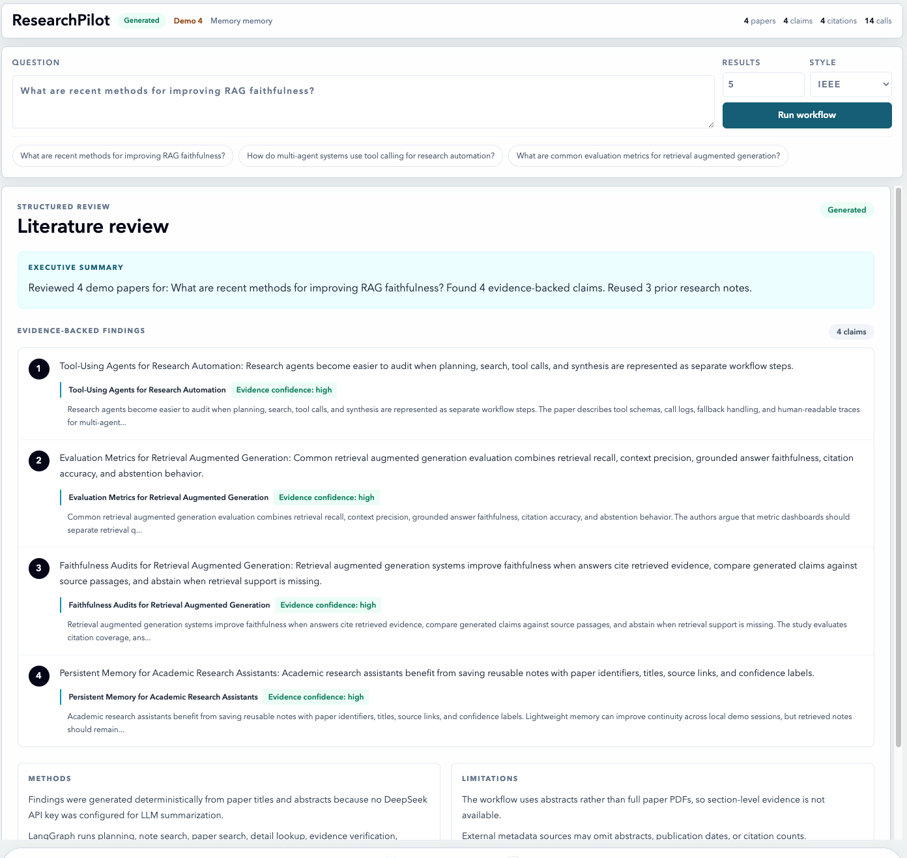
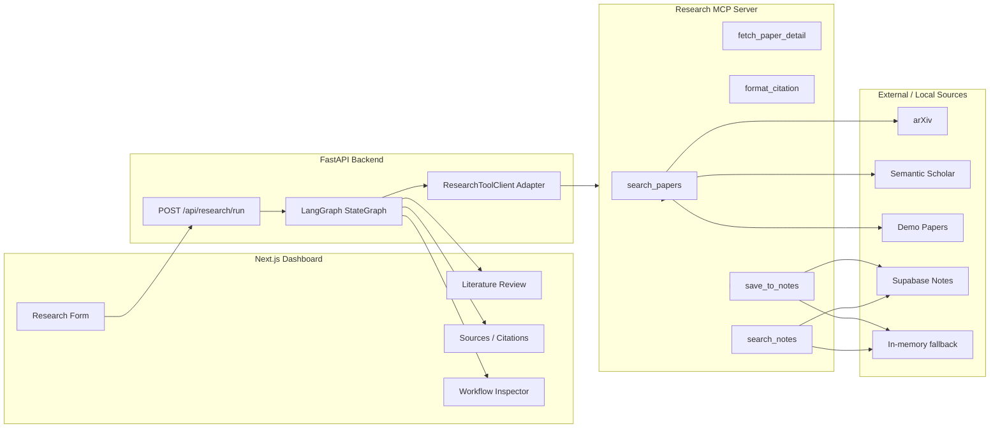

# ResearchPilot：MCP 学术科研效率助手

ResearchPilot 是一个本地运行的 AI 学术研究工作流助手。用户输入研究问题后，系统会通过 LangGraph 编排多步骤 workflow，调用自定义 MCP Server 工具完成论文检索、历史 notes 复用、论文详情获取、摘要发现、证据校验、引用生成和 structured literature review 展示。

这个项目的重点不是做一个普通 RAG 聊天框，而是把 agent 的执行过程暴露出来：前端 dashboard 会展示每个 workflow step、MCP tool call、fallback 状态、证据片段、confidence label、引用和 warnings，方便调试、演示和面试讲解。

## 演示截图



更多本地演示截图：

- [Sources and citations](docs/screenshots/researchpilot-sources-citations.png)
- [Bibliography output](docs/screenshots/researchpilot-bibliography.png)
- [Mobile audit inspector](docs/screenshots/researchpilot-mobile-inspector.png)

## 功能亮点

- 使用 FastAPI 提供 `/api/research/run` 和 `/health` 接口。
- 使用 LangGraph `StateGraph` 编排多步骤研究流程。
- 自定义 Research MCP Server，暴露 `search_papers`、`fetch_paper_detail`、`format_citation`、`save_to_notes` 和 `search_notes` 工具。
- 后端支持 local direct、single-call MCP stdio 和 persistent MCP session 三种 tool client 模式。
- 支持 arXiv 搜索、Semantic Scholar fallback、demo fixture、结果去重和 10 分钟内存缓存。
- 支持 IEEE、APA 和 BibTeX 引用格式生成。
- 支持 Supabase notes 存储；未配置 Supabase 时自动回退到 in-memory notes。
- 支持 pgvector-ready `research_notes` schema，预留 `embedding vector(1536)` 字段。
- 缺少 DeepSeek API key 时使用确定性 abstract-based fallback，保证本地 demo 不依赖外部 LLM。
- evidence-first 输出：为 finding 关联 source paper、abstract snippet 和 confidence label。
- Next.js dashboard 展示 literature review、sources、citations、workflow timeline、tool call logs、memory notes 和 warnings。
- pytest 覆盖 MCP tools、graph routing、API response、citation formatting、evidence verification、demo mode 和 cache fallback。

## 技术栈

- Next.js App Router
- React
- TypeScript
- Tailwind CSS
- FastAPI
- Pydantic
- LangGraph
- MCP Python SDK
- OpenAI-compatible DeepSeek client
- arXiv API
- Semantic Scholar Graph API
- Supabase / PostgreSQL / pgvector-ready schema
- pytest

## 系统架构



更多架构说明见 [docs/ARCHITECTURE.md](docs/ARCHITECTURE.md)。

## Agent Workflow

ResearchPilot 的后端不是一个单次 completion，而是固定、可追踪的 workflow：

1. `plan_research_task`：生成研究计划和目标来源。
2. `search_notes`：优先检索历史 research notes。
3. `search_papers`：搜索 arXiv / Semantic Scholar / demo fixture。
4. `fetch_paper_details`：拉取论文详情或保留搜索元数据。
5. `extract_summary`：使用 DeepSeek 或 deterministic fallback 抽取 findings。
6. `verify_evidence`：用 abstract keyword overlap 给 finding 标注 confidence。
7. `format_citations`：生成 IEEE / APA / BibTeX 引用。
8. `save_notes`：保存有证据支持的 findings。
9. `generate_final_review`：返回 structured literature review。

前端会展示 step trace、tool call input/output preview、duration、fallback_used、warnings 和 low-confidence claims。

## 目录结构

```text
backend/
  app/
    agent/              LangGraph state, graph, nodes
    api/                FastAPI research route
    core/               settings and logging
    llm/                DeepSeek client
    mcp_client/         local / MCP / persistent MCP adapters
    models/             Pydantic response schemas
    services/           citation, note, verification services
  tests/                backend API and graph tests
mcp_server/
  clients/              arXiv and Semantic Scholar clients
  data/                 demo paper fixtures
  tools/                MCP tool implementations
  tests/                MCP tool tests
frontend/
  app/research/         dashboard page
  components/           form, review, source table, inspector panels
  lib/                  API client and TypeScript types
supabase/
  schema.sql            pgvector-ready notes schema
docs/
  ARCHITECTURE.md
  DEMO_SCRIPT.md
  INTERVIEW_NOTES.md
  screenshots/
scripts/
  run_backend.sh
  run_frontend.sh
  run_mcp_server.sh
  test_all.sh
```

## Quick Start

在项目根目录执行：

```bash
python3 -m venv .venv
.venv/bin/python -m pip install -r backend/requirements.txt -r mcp_server/requirements.txt
cp .env.example .env
cd frontend
npm install
cd ..
RESEARCHPILOT_DEMO_MODE=true scripts/run_backend.sh
```

另开一个终端：

```bash
scripts/run_frontend.sh
```

打开：

```text
http://127.0.0.1:3000/research
```

## 环境变量

使用 `.env.example` 作为模板，真实值放在本地 `.env`，不要提交。

```bash
DEEPSEEK_API_KEY=
DEEPSEEK_BASE_URL=https://api.deepseek.com/v1
DEEPSEEK_MODEL=deepseek-chat
ARXIV_TIMEOUT_SECONDS=10
SEMANTIC_SCHOLAR_API_KEY=
RESEARCHPILOT_DEMO_MODE=false

SUPABASE_URL=
SUPABASE_SERVICE_ROLE_KEY=
SUPABASE_NOTES_TABLE=research_notes

RESEARCH_TOOL_CLIENT_MODE=local
MCP_SERVER_COMMAND=
MCP_SERVER_ARGS=mcp_server/server.py
MCP_SERVER_CWD=
MCP_FALLBACK_TO_LOCAL=true

NEXT_PUBLIC_API_BASE_URL=http://localhost:8000
```

说明：

- `DEEPSEEK_API_KEY` 是可选项。未配置时会使用 deterministic abstract-based fallback。
- `SEMANTIC_SCHOLAR_API_KEY` 是可选项。公共搜索可不配置，配置后可改善 rate limit。
- `SUPABASE_URL` 和 `SUPABASE_SERVICE_ROLE_KEY` 是可选项。未配置时 notes 使用 in-memory fallback。
- `RESEARCH_TOOL_CLIENT_MODE` 可选 `local`、`mcp_single` 或 `mcp_persistent`。
- `RESEARCHPILOT_DEMO_MODE=true` 适合本地演示，不依赖外部论文 API。

## MCP 使用方式

直接启动 MCP stdio server：

```bash
PYTHONPATH=mcp_server .venv/bin/python mcp_server/server.py
```

也可以使用项目脚本：

```bash
scripts/run_mcp_server.sh
```

后端 tool client 模式：

- `local`：直接调用 Python tool function，适合测试和本地 deterministic demo。
- `mcp_single`：每次 tool call 启动一个 MCP stdio server。
- `mcp_persistent`：复用一个 MCP stdio session，并在 FastAPI lifespan shutdown 时关闭。

如果 MCP 模式启动失败且 fallback 开启，后端会记录 `fallback_used: true` 并使用 local tool fallback。

## Demo 流程

推荐使用 demo mode：

```bash
RESEARCHPILOT_DEMO_MODE=true scripts/run_backend.sh
scripts/run_frontend.sh
```

推荐问题：

```text
What are recent methods for improving RAG faithfulness?
```

演示时可以重点看：

1. 顶部指标：papers、claims、citations、calls。
2. Literature review：findings、methods、limitations 和 evidence snippets。
3. Sources：source label、confidence label 和 citation。
4. Bibliography：IEEE / APA / BibTeX 输出。
5. Audit inspector：workflow steps、tool calls、memory notes 和 warnings。

完整演示脚本见 [docs/DEMO_SCRIPT.md](docs/DEMO_SCRIPT.md)。

## 测试

```bash
scripts/test_all.sh
```

或者分别运行：

```bash
.venv/bin/python -m pytest -q
npm --prefix frontend run typecheck
```

当前测试覆盖：

- citation formatting
- evidence verification
- MCP search/detail/citation/note tools
- Semantic Scholar response normalization
- demo mode and cache fallback
- MCP client mode selection and persistent fallback
- LangGraph routing and FastAPI response shape
- README/script reproducibility checks

## 安全说明

- 不要提交 `.env`。
- 不要把 `DEEPSEEK_API_KEY`、`SUPABASE_SERVICE_ROLE_KEY` 或任何 API key 放进截图、commit、issue 或 README。
- 只有 `NEXT_PUBLIC_` 前缀的变量可以被前端读取。
- demo mode 使用本地 fixture paper，并明确标记为 `source: "demo"`，不会伪装成真实 arXiv 或 Semantic Scholar 结果。
- 当前项目没有登录系统，定位是本地作品集 demo，不是多用户生产系统。

## 已知限制

- 当前只基于 paper abstract 做证据校验，不读取全文 PDF。
- confidence label 使用 keyword overlap，是轻量 guardrail，不等同于完整事实核查。
- Supabase schema 已预留 pgvector 字段，但目前还没有生成 embeddings，也没有启用向量相似度检索。
- Semantic Scholar detail lookup 目前不单独拉取详情，必要时使用搜索结果 metadata。
- 项目还没有线上部署、认证系统或 CI/CD。

## 后续改进

- 增加 PDF ingestion 和 section-level evidence。
- 生成 embeddings，并用 pgvector 做 notes similarity search。
- 增加 streaming workflow events。
- 优化 arXiv / Semantic Scholar 的跨源排序。
- 增加生产级 auth、部署配置和浏览器端 E2E 测试。

## 简历描述参考

- 基于 Next.js、FastAPI、LangGraph 和自定义 MCP Server 构建本地学术研究助手，支持论文检索、详情获取、证据抽取、引用生成、prior-note reuse 和 structured literature review。
- 设计多步骤 Agent workflow，覆盖 planning、note search、paper search、fetch detail、summary extraction、evidence verification、citation formatting 和 note saving，并在前端展示 step trace 与 tool call logs。
- 实现 evidence-first 输出机制，为关键结论关联 source paper、abstract snippet、confidence label 和 IEEE / APA / BibTeX citation，提高研究结果可追溯性。
- 实现 arXiv / Semantic Scholar 检索编排、demo mode、cache / fallback handling 和 in-memory notes fallback；编写 pytest 覆盖 MCP tools、graph routing、API response、citation formatting 和 evidence verification 等 31 项测试。
