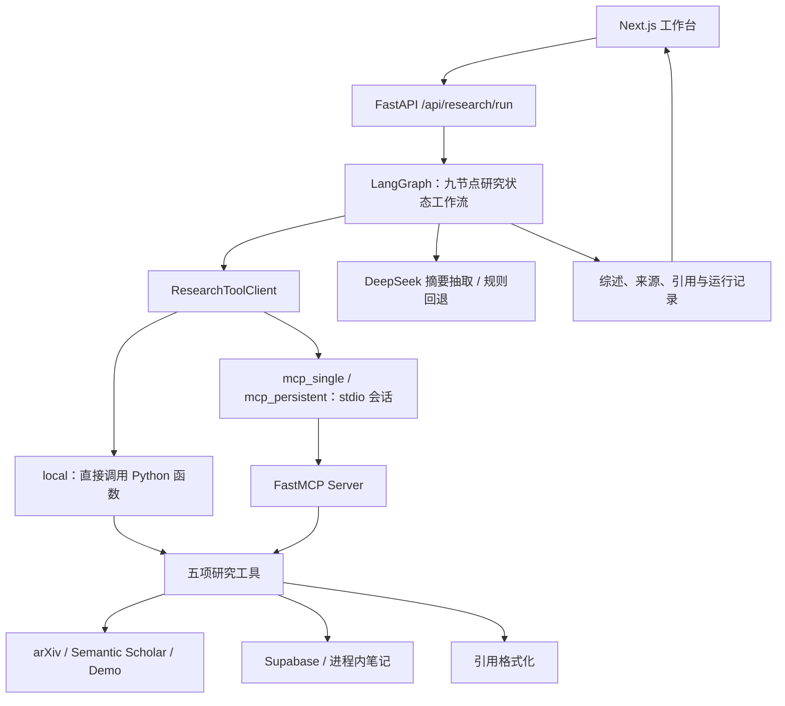

# ResearchPilot

**把论文检索、摘要整理与引用生成，串成一条可追踪的研究工作流。**

输入研究问题，获得候选论文、摘要级结论、来源关联和参考文献，并查看每一步的工具调用与降级记录。面向文献调研的初步整理，采用 **LangGraph 状态编排 + MCP 工具层 + Next.js 工作台**，当前为本地单用户应用。

[界面预览](#界面预览) · [关键设计](#关键设计) · [本地运行](#本地运行) · [验证记录](docs/VALIDATION.md) · [架构详解](docs/ARCHITECTURE.md)

## 项目概览

| 使用者需要什么 | 系统如何处理 | 最终可以查看什么 |
| --- | --- | --- |
| 从研究问题开始查资料 | 检索 arXiv，结果不足时尝试 Semantic Scholar；按条件追加一轮查询 | 论文标题、作者、摘要与来源 |
| 整理初步研究结论 | DeepSeek 从摘要抽取候选结论；未配置或失败时按规则选取摘要句子 | 结构化综述、方法说明与限制 |
| 回到原始资料核对 | 按摘要关键词重合度关联论文，生成 IEEE / APA / BibTeX 格式文本 | 来源摘要预览、匹配等级与参考文献 |
| 判断这次运行是否可靠 | 记录步骤、工具参数预览、耗时、告警及回退信息 | 运行审计与历史笔记 |

**实现规模：9 个工作流节点 · 5 项 MCP 工具 · 3 种工具执行模式。**

注意：`confidence` 是摘要词汇匹配等级，不是事实正确率。当前不读取论文全文，也不保证检索结果与问题相关；研究结论仍需人工核对。

## 界面预览

以下截图来自本地 **Demo 模式实际运行**：使用仓库内的虚构论文样例、规则式摘要提取和进程内笔记，不调用外部模型。它们展示交互与执行流程，**不代表真实论文检索效果或模型准确率**。


<details>
<summary>展开查看：综述、论文来源、参考文献与工具调用</summary>

### 结构化综述

结论旁展示来源摘要与匹配等级，方法区说明本次使用的是模型还是规则回退。


### 论文来源

Demo 条目显式标记，不冒充实时搜索获得的论文。


### 参考文献


### 工具调用审计

可展开单次调用的输入、输出预览、耗时和状态；内存存储告警会保留。


</details>

复现方式见 [演示步骤](docs/DEMO_SCRIPT.md)。

## 关键设计

| 设计重点 | 实现与取舍 | 源码入口 |
| --- | --- | --- |
| 显式工作流 | 九个节点共享研究状态；流程由代码控制，补搜最多一轮，避免无限循环 | [graph.py](backend/app/agent/graph.py)、[nodes.py](backend/app/agent/nodes.py) |
| 编排与工具解耦 | 同一工具接口支持本地函数、单次 stdio、持久 MCP 会话；持久模式通过后台事件循环和队列执行调用 | [client.py](backend/app/mcp_client/client.py)、[server.py](mcp_server/server.py) |
| 可解释的降级 | 外部检索失败时尝试缓存，模型失败时提取摘要句子，MCP 失败时可回退本地工具，并返回告警 | [search_papers.py](mcp_server/tools/search_papers.py)、[nodes.py](backend/app/agent/nodes.py) |
| 输出可核对 | 结论关联论文与摘要预览，保留低匹配结果；关键词启发式可解释，但不做语义蕴含判断 | [verification_service.py](backend/app/services/verification_service.py) |

### 一次请求如何流转


```mermaid
flowchart TD
    UI["Next.js 工作台"] --> API["FastAPI /api/research/run"]
    API --> Graph["LangGraph：九节点研究状态工作流"]
    Graph --> Adapter["ResearchToolClient"]
    Adapter --> Local["local：直接调用 Python 函数"]
    Adapter --> MCP["mcp_single / mcp_persistent：stdio 会话"]
    Local --> Tools["五项研究工具"]
    MCP --> Server["FastMCP Server"] --> Tools
    Tools --> Search["arXiv / Semantic Scholar / Demo"]
    Tools --> Notes["Supabase / 进程内笔记"]
    Tools --> Citation["引用格式化"]
    Graph --> Model["DeepSeek 摘要抽取 / 规则回退"]
    Graph --> Result["综述、来源、引用与运行记录"]
    Result --> UI
```

九个节点依次完成：**任务规划 → 笔记检索 → 论文搜索 → 元数据获取 → 候选结论抽取 → 摘要匹配 → 引用格式化 → 笔记保存 → 综述组装**。

`adaptive search` 在论文搜索节点内部触发，并非第十个节点。仅当已有结果非空、数量不足且包含非 Demo 论文时追加一次查询；不是由模型自主决定，也不是根据最终结论质量循环检索。

### MCP 工具与执行模式

五项工具：`search_papers`、`fetch_paper_detail`、`search_notes`、`save_to_notes`、`format_citation`。

| 模式 | 执行方式 | 生命周期与限制 |
| --- | --- | --- |
| `local`（默认） | 直接调用工具函数，不经过 MCP 协议 | 笔记和缓存随后端进程存活 |
| `mcp_single` | 每次工具调用启动 stdio 服务并初始化会话 | 进程内笔记不能跨工具调用保留 |
| `mcp_persistent` | 复用 MCP 服务进程和会话 | 减少重复启动；不是数据库持久化，当前工具调用串行执行 |

## 本地运行

需要 Python、Node.js/npm，以及 Bash 环境（macOS / Linux；Windows 可使用 WSL）。本次验证环境和依赖版本见 [验证记录](docs/VALIDATION.md)。

```bash
git clone https://github.com/AZ123IT/ResearchPilot.git
cd ResearchPilot
python3 -m venv .venv
.venv/bin/python -m pip install -r backend/requirements.txt -r mcp_server/requirements.txt
cd frontend
npm install
cd ..
```

### 先运行无密钥演示

终端一，在项目根目录执行。禁用本地 `.env` 读取，并清空可选服务凭据，避免误调用已有云服务：

```bash
PYTHON_DOTENV_DISABLED=1 DEEPSEEK_API_KEY= SUPABASE_URL= SUPABASE_SERVICE_ROLE_KEY= \
RESEARCH_TOOL_CLIENT_MODE=local RESEARCHPILOT_DEMO_MODE=true scripts/run_backend.sh
```

终端二，同样在项目根目录执行：

```bash
scripts/run_frontend.sh
```

打开 [研究工作台](http://127.0.0.1:3000/research)，或 [API 文档](http://127.0.0.1:8000/docs)。示例问题：`What are recent methods for improving RAG faithfulness?`

### 接入真实检索与模型

从 [.env.example](.env.example) 复制一份本地 `.env`（已有文件不要覆盖），设置 `RESEARCHPILOT_DEMO_MODE=false`，按需填写 `DEEPSEEK_API_KEY`，再用 `scripts/run_backend.sh` 重启后端。arXiv 检索不需要模型密钥；模型未配置时仍会走规则式摘要提取。

| 配置 | 用途 |
| --- | --- |
| `DEEPSEEK_API_KEY`、`DEEPSEEK_BASE_URL`、`DEEPSEEK_MODEL` | 可选的模型摘要抽取；最多输入前五篇论文的标题与摘要 |
| `SEMANTIC_SCHOLAR_API_KEY` | 可选的 Semantic Scholar 凭据，使用受服务端限制 |
| `SUPABASE_URL`、`SUPABASE_SERVICE_ROLE_KEY` | 可选的持久笔记存储；使用前执行 [schema.sql](supabase/schema.sql) |
| `RESEARCH_TOOL_CLIENT_MODE` | `local`、`mcp_single` 或 `mcp_persistent` |
| `MCP_FALLBACK_TO_LOCAL` | MCP 失败时是否允许回退本地工具；验证真实 MCP 链路时设为 `false` |
| `NEXT_PUBLIC_API_BASE_URL` | 前端 API 地址；启动脚本从终端环境读取，默认 `http://127.0.0.1:8000` |

MCP 独立入口为 `scripts/run_mcp_server.sh`。后端 MCP 模式由客户端启动服务，无需再手动启动一个服务进程；完整配置见 [架构与会话说明](docs/ARCHITECTURE.md#mcp-会话与工具边界)。

## 验证与测试

**2026-10-03 本地验证：32 项 pytest 通过，TypeScript 类型检查通过。** 完整命令、构建与浏览器运行结果见 [验证记录](docs/VALIDATION.md)。

```bash
scripts/test_all.sh
```

测试覆盖工作流路由、API 响应结构、引用格式、摘要匹配、搜索缓存、工具模式和回退分支。**通过回归测试不等于检索质量已达标**：外部 API 主要使用模拟数据，当前没有真实查询集上的相关性/事实性评测，也没有已接入的 GitHub Actions CI。

## 技术栈与代码导航

| 层级 | 技术 | 入口 |
| --- | --- | --- |
| 交互与展示 | Next.js、React、TypeScript、Tailwind CSS | [frontend/app/research](frontend/app/research)、[components](frontend/components) |
| API 与状态编排 | FastAPI、Pydantic、LangGraph | [backend/app/api](backend/app/api)、[agent](backend/app/agent) |
| 工具协议与数据源 | MCP Python SDK / FastMCP、httpx | [mcp_server](mcp_server)、[mcp_client](backend/app/mcp_client) |
| 模型与笔记 | DeepSeek、Supabase PostgreSQL / 内存存储 | [llm](backend/app/llm)、[notes.py](mcp_server/tools/notes.py) |
| 回归验证 | pytest、TypeScript typecheck | [backend/tests](backend/tests)、[mcp_server/tests](mcp_server/tests) |

## 当前边界与改进方向

- **摘要级处理**：不下载全文 PDF；摘要预览是截取文本，不是精确定位到支持句。
- **启发式匹配**：关键词重合不能判断否定、因果或问题相关性，`high` 也可能误报。下一步应先建立相关性与结论支持度评测集，再改进检索和校验。
- **固定工作流**：不是多智能体自主协作；规划和综述组装由代码模板完成，尚无流式事件或断点续跑。
- **有限笔记复用**：按关键词检索并展示历史笔记，不将其注入 DeepSeek 上下文；`vector(1536)` 仅为预留字段，未实现向量检索。
- **本地单用户**：没有认证、租户隔离、公开部署或生产容量验证。持久 MCP 会话与内存缓存都不能替代数据库。

安全提示：不要提交 `.env`，不要向前端暴露服务密钥。启用 DeepSeek 会发送问题与论文标题/摘要；启用 Supabase 会存储笔记。不要使用未经许可的敏感研究资料。

更多说明：[架构与实现取舍](docs/ARCHITECTURE.md) · [演示与故障排查](docs/DEMO_SCRIPT.md) · [验证记录](docs/VALIDATION.md) · [技术问答](docs/INTERVIEW_NOTES.md)
